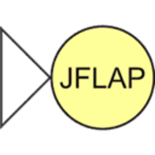

    <picture>
        <source media="(prefers-color-scheme: dark)" srcset="../assets/logo-puc_white.svg"> 
    </picture>
    <picture>
        <source media="(prefers-color-scheme: dark)" srcset="../assets/logo-puc_cc_white.svg"> 
    </picture>
        

<h1><b>Projects developed during the bachelor's degree in </b> <i> Computer Science - PUC Minas<i></h1>
<h3><a href="https://github.com/lucaslealll">@lucaslealll</a></h3>

<h2>SUMMARY</h2>

- [**Assembly MIPS Study Files**](#assembly-mips-study-files)
- [**Complexity Analysis and Algorithms – Comparison between "P vs NP" complexities**](#complexity-analysis-and-algorithms--comparison-between-p-vs-np-complexities)
- [**Image Processing – Ads Validator By Emotional Recognition**](#image-processing--ads-validator-by-emotional-recognition)
- [**JAVA API Rest Communication w/ GeoDB Cities**](#java-api-rest-communication-w-geodb-cities)
- [**JAVA Android – API Rest Communication w/ GeoDB Cities for Android Devices**](#java-android--api-rest-communication-w-geodb-cities-for-android-devices)
- [**Image Processing – Subtraction, Object Delineation, Filters (high boost, high pass), performance comparison**](#image-processing--subtraction-object-delineation-filters-high-boost-high-pass-performance-comparison)
- [**JAVA Interface for ADB (Android Debug Bridge)**](#java-interface-for-adb-android-debug-bridge)
- [**Cryptocurrency Tracker**](#cryptocurrency-tracker)
- [**JAVA Hash Generator**](#java-hash-generator)
- [**Identification of License Plate of Criminal After Violation**](#identification-of-license-plate-of-criminal-after-violation)
- [**Short Projects / Tech Study**](#short-projects--tech-study)
  

## **Assembly MIPS Study Files**
> ASM | MIPS   Repo: https://github.com/lucaslealll-puc-cc/puc-aocii-assembly-mips
>
> Independent study of low-level languages; Language: Assembly MIPS; IDE: MARS (MIPS Assembler and Runtime Simulator)

## **Complexity Analysis and Algorithms – Comparison between "P vs NP" complexities**
> C | Python   Repo: https://github.com/lucaslealll-puc-cc/puc-ca-20250625-trabalho-benchmark-complexidades-p-np
> 
> The objective is to demonstrate and compare the runtime characteristics (complexity) of several algorithms in practice

## **Image Processing – Ads Validator By Emotional Recognition**
> Python | FER | MediaPipe | Streamlit   Repo: https://github.com/lucaslealll-puc-cc/puc-vcrm-20250616-pjt-final-ads-validator
> 
> AVBER - Ads Validator By Emotional Recognition: Integrated analysis of advertising campaigns based on visual and emotional responses from the viewer's cognitive perspective

## **JAVA API Rest Communication w/ GeoDB Cities**
> JAVA | GeoDB Cities   Repo: https://github.com/lucaslealll-puc-cc/puc-sd-20260626-java-client-rest
> 
> Implementation of a client application that uses a web service that provides an API that follows the REST (REpresentational State Transfer) architectural style.

## **JAVA Android – API Rest Communication w/ GeoDB Cities for Android Devices**
> JAVA | Android | GeoDB Cities     Repo: https://github.com/lucaslealll-puc-cc/puc-eam-android-geodb-app
> 
> Implementation of a client application that uses a web service that provides an API that follows the REST (REpresentational State Transfer) architectural style.

## **Image Processing – Subtraction, Object Delineation, Filters (high boost, high pass), performance comparison**
> Python   Repo: https://github.com/lucaslealll-puc-cc/puc-vcrm-20250608-tecnicas-pre-process
> 
> Implementation of processing techniques.

## **JAVA Interface for ADB (Android Debug Bridge)**
> JAVA | ADB   Repo: https://github.com/lucaslealll-puc-cc/puc-sc-adb-interface
> 
> Development of an interface that is able to improve the experience of using the ADB tool.

## **Cryptocurrency Tracker**
> Python   Repo: https://github.com/lucaslealll-puc-cc/puc-pibic-projeto-28131-2022-cripto-tracker
> 
> This Python application aims to collect Bitcoin wallet data using APIs generate Dataframes from this data and perform data processing.

## **JAVA Hash Generator**
> JAVA   Repo: https://github.com/lucaslealll-puc-cc/puc-sc-gerador-hash
> 
> Check changes to a file and/or group of files, through of the HASH code.

## **Identification of License Plate of Criminal After Violation** 
> ImageJ | FFMPEG | Linux   Repo: https://github.com/lucaslealll-puc-cc/puc-sc-pericia-forense-video

## **Short Projects / Tech Study**
| Tech | Projects |
|-------|----------|
|  **Assembly** (MIPS) | [Assembly](./Assembly/) [Assembly Inline](./Assembly/asm-inline/) [Assembly Mips](./Assembly-Mips/asm-mips/) |
|  **Automatons** (JFLAP) | [JFLAP Automaton](./JFLAP-Automatos) [Stack Automaton](./JFLAP-Automatos) [Turing Machine Automaton](./JFLAP-Automatos) |
|  **Blender** | [Displacement](./Blender/Blender-Displacement/) [Reflection, Lighting and HDR](./Blender/Blender-Macaco/) [Normal Maps](./Blender/Blender-NormalMaps/) [Texture, Background and Models](./Blender/Blender-UrsoCanecaBarril/) |
|  **C** | [Parking Control](./C/C-Estacionamentos/) [Encryption and Decryption using Pipes and Water Mark](./C/C-Pipes/) [Study](./C/C-Estudo/) |
|  **C++** | [Soccer Goal](./C++/Cpp-OpenglFreeglutGol/) [3D Model Name](./C++/Cpp-OpenglFreeglutNome3D/) [Tic Tac Toe](./C++/Cpp-OpenglFreeglutTicTacToe/) |
|  **CoppeliaSim** | [Line Tracer](./CoppeliaSim/line-tracer-Senna-F1-Interlagos-circuit/) [Niryo One - Object Positioning](./CoppeliaSim/niryo-one-object-positioning.ttt) [Pionner - Making Circuit](./CoppeliaSim/pionner-making-circuit-by-sensor-orientation/) [Scara - Rotation 360](./CoppeliaSim/scara-rotation-360-and-speed-controller.ttt) [Serial Bot - Three Joint](./CoppeliaSim/three-joint-serial-robot/) |
|  **Java** | [Cyber Security Lab](https://sites.google.com/view/cyberonelab/pessoas?authuser=0#h.9183b6clno28) [Hash Generator](https://github.com/lucaslealll/java-GeradorHash) [ADB Interface](https://github.com/lucaslealll/java-ADBInterface) [Android API About Cities](https://github.com/lucaslealll/java-AndroidGeodbAPI) [Study OOP](./Java/Java-EstudoPoo/) [Pen OOP](./Java/poo-study-pen/) [Bank Current Account](./Java/bank-current-account/) [Sort Dessert](./Java/sorts-dessert/) |
|  **Lisp** | [Lisp Review](./Lisp/lisp-review.pdf) |
|  **Lua** | [Max and Min Value of an Array](./Lua/array-max-min-value.lua) [Sort Array With BubbleSort Method](./Lua/bubblesort-array.lua) |
|  **Packet Tracer** (Cisco) | [Residencial Automation](./PacketTracer/sound-detector.pkt) [Motion Sensor Alarm](./PacketTracer/motion-sensor.pkt) [Smoke Sensor Alarm](./PacketTracer/smoke-detector.pkt) [Sound Sensor Alarm](./PacketTracer/sound-detector.pkt) [LED Communication between 2 MCUs](./PacketTracer/PUC%20-%20IOT%20-%2020250827%20-%20Atividade%202%20-%20Comunicação%20entre%20MCUs.pkt) |
|  **Pascal** | [Car Route Matrix](./Pascal/calculate-route-from-matrix.pas) [Division by Subtraction](./Pascal/division-by-subtraction.pas) [Factorial Recursive](./Pascal/factorial-with-recursive-function.pas) [Guess Value](./Pascal/guess-value.pas) [Sum Results](./Pascal/sum-results.pas) |
|  **Prolog** | [Calculate Gradebook](./Prolog/calculate-gradebook.pro) [Count Vowels](./Prolog/count-vowels-from-list.pro) [List Translation](./Prolog/list-based-translation.pro) [Print List Elements](./Prolog/print-list-elements.pro) |
|  **Python** (Notebooks) | [Intro Python](./Python/Introduction_to_Python_Language.ipynb) [Python Introduction](./Python/Python_Introduction.ipynb) [Graphical View](./Python/Graphical_View.ipynb) [Data Analysis](./Python/Data_Analysis.ipynb) [Pre Processing](./Python/Data_Preprocessing.ipynb) [Dataset Preprocessing 1 & 2](./Python/Dataset_Preprocessing.ipynb) [Probabilistic Models](./Python/Probabilistic_Models.ipynb) [Normal Distribution](./Python/Normal_Probability_Distribution_Model.ipynb) [Exploratory Analysis](./Python/Exploratory_Analysis_Descriptive_Statistics_Correlation.ipynb) [Churn & ML](./Python/Churn_Modeling_Machine_Learning_Algorithms.ipynb) [CNN & CIFAR10](./Python/CNN_CIFAR10.ipynb) |
|  **Shell Script** | **Network:** [ARP Mapping](./ShellScript/network/arp-mapping.sh) / [MTU Identification](./ShellScript/network/mtu-identification.sh) **Tools:** [Install Useful & Remove Useless Apps](./ShellScript/tools/get-useful-rm-useless.sh) / [Study](./ShellScript/study/) |
|  **SQL** | [Airport Database](./SQL/Database-Airport/) [Store Database](./SQL/Database-Store/) |