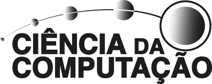

    <picture>
        <source media="(prefers-color-scheme: dark)" srcset="../assets/logo-puc_white.svg"> 
    </picture>
    <picture>
        <source media="(prefers-color-scheme: dark)" srcset="../assets/logo-puc_cc_white.svg"> 
    </picture>
        

<h1><b>Projects developed during the bachelor's degree in </b> <i> Computer Science - PUC Minas<i></h1>
<h3><a href="https://github.com/lucaslealll">@lucaslealll</a></h3>

<h2>SUMMARY</h2>